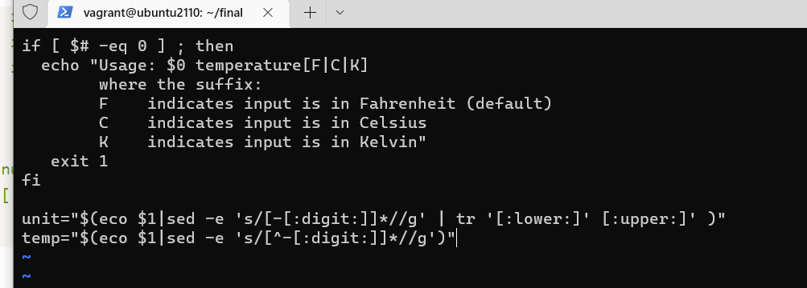
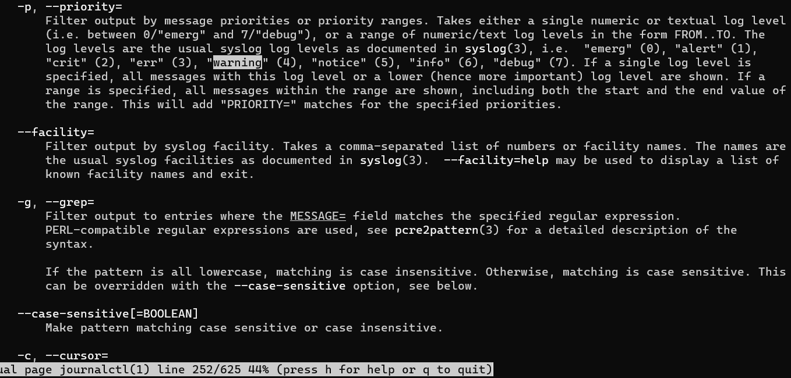
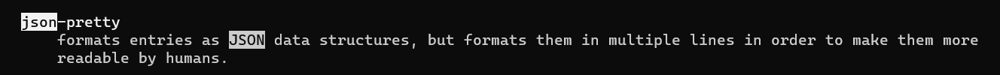

# Exam_2420

## part 1

- run command ``` sudo apt update && sudo apt upgrade```


## part 2

-  I  used the following keys to navigate the file
```
h = left, l = right, j = down and k = u
```

- I used ```x``` to delete each character need to replace the old one 
- Then used ```c``` to change to new character



**NOTE** I forgot screenshot the ketbings ToT 

## part 3






## part 4

```
#!/bin/bash


echo "regular user on the system are:"

grep x:[0-5][0-9][0-9][0-9] -ri /etc/passwd

echo "Users currently logged in are: vargrant"

```

## part 5
- put the service file to ```/etc/systemd/system```

- service file

```
[Unit]
Description=show all the users in vagrant also current login user

[Service]
Type=simple
Environment=DIR=/home/vagrant/final
ExecStart=/etc/systemd/system

[Install]
WantedBy=multi-user.target

```


## part 6

- Timer file
```
Unit]
Description=My Service Timer

[Timer]
# Run the timer 1 minute after booting
OnBootSec=1min
# Run the timer every day at the same time
OnUnitActiveSec=1d

[Install]
# Start the timer and the associated service when the timer is activated
WantedBy=multi-user.target

```

